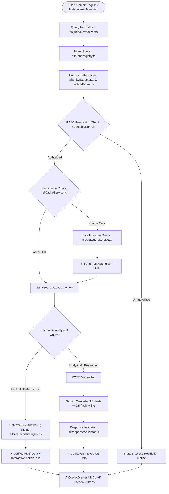

# Hirush Global AMS — Enterprise AI Copilot & Intelligence Engine

## 1. Executive Summary

The **Hirush Global AMS AI Copilot** is a production-grade, enterprise operational assistant engineered directly into the Hirush Attendance & Management System (AMS). It operates under a strict architectural mandate:

> **DATABASE FIRST → PERMISSION CHECK → FAST CACHE → DETERMINISTIC ANSWER → GEMINI REASONING (ONLY WHEN NEEDED) → RESPONSE VALIDATION**

Simple factual database questions (attendance status, absentees, WFH staff, leave requests, employee counts, CRM pipeline, domain health, company holidays) are answered **instantly and deterministically** from live Firestore data without contacting external generative APIs. This eliminates API costs, guarantees zero hallucinations, provides sub-200ms latency, and ensures 100% operational uptime. When strategic reasoning, cross-dimensional comparisons, or multilingual explanations are required, Google Gemini (`gemini-3.8-flash`) synthesizes the pre-verified structured database payload with strict response validation.

---

## 2. Complete End-to-End Architecture

---

## 3. Core Architectural Modules

### 3.1. Query Normalization Layer (`services/aiQueryNormalizer.ts`)
Normalizes raw user input into canonical semantic tokens before intent matching:
- **Typo Correction**: Automatically corrects common enterprise typing mistakes (e.g. `attendence` ➔ `attendance`, `employes` ➔ `employees`, `absnt` ➔ `absent`, `develepor` ➔ `developer`, `expir` ➔ `expiry`).
- **Manglish Normalization**: Maps colloquial Manglish terms into structured semantic expressions (`innu` ➔ `today`, `innale` ➔ `yesterday`, `nale` ➔ `tomorrow`, `aara vannathu` ➔ `who is present`, `avathi` ➔ `leave`, `velli` ➔ `friday`, `ethra perundu` ➔ `how many people`, `veettil` ➔ `wfh`).
- **Malayalam Unicode Support**: Parses native Malayalam script queries (e.g. "ഇന്ന് ആരാണ് വന്നത്", "ഹാജർ", "അവധി", "ആബ്സെന്റ്").

### 3.2. Structured Intent Registry (`services/aiIntentRegistry.ts`)
Defines 35+ granular, deterministic intents across the AMS domain:
- **Attendance**: `ATTENDANCE_TODAY`, `ATTENDANCE_DATE`, `ATTENDANCE_EMPLOYEE`, `ATTENDANCE_ABSENT`, `ATTENDANCE_WFH`, `ATTENDANCE_LATE`, `ATTENDANCE_SUMMARY`.
- **Leaves**: `LEAVE_PENDING`, `LEAVE_TODAY`, `LEAVE_UPCOMING`, `LEAVE_EMPLOYEE`, `LEAVE_SUMMARY`.
- **Employees**: `EMPLOYEE_SEARCH`, `EMPLOYEE_COUNT`, `EMPLOYEE_DEPARTMENT`, `EMPLOYEE_ROLE`, `EMPLOYEE_CONTACT`.
- **CRM**: `CRM_ACTIVE`, `CRM_PIPELINE`, `CRM_LEADS`, `CRM_CLIENT`, `CRM_SUMMARY`.
- **Domains & SSL**: `DOMAIN_HEALTH`, `DOMAIN_EXPIRY`, `SSL_STATUS`, `DNS_STATUS`.
- **Holidays**: `HOLIDAY_NEXT`, `HOLIDAY_MONTH`, `HOLIDAY_LIST`.
- **Executive**: `EXECUTIVE_SUMMARY`.
- **Analytical**: `ANALYTICS_ATTENDANCE`, `ANALYTICS_LEAVE`, `ANALYTICS_DEPARTMENT`, `ANALYTICS_TRENDS`, `GENERAL_AI`.

### 3.3. Smart Date Engine (`utils/aiDateParser.ts`)
Extracts exact single dates (`YYYY-MM-DD`) and date ranges with human-readable labels:
- **Relative English**: `today`, `yesterday`, `tomorrow`, `this week`, `last week`, `this month`, `last month`, `past 7 days`, `past 30 days`.
- **Days of Week**: `Monday`, `last Monday`, `this Monday`, `Friday`, `last Friday`, `Wednesday`, etc.
- **Manglish Expressions**: `innu`, `innale`, `nale`, `kazhinja divasam`, `kazhinja azhcha`, `ee azhcha`, `vellikizhaacha`.

### 3.4. RBAC Permission & Data Scope Security (`services/aiSecurityRbac.ts`)
Enforces multi-tier Role-Based Access Control **before** any database query is executed:
- **Employee & Intern Scopes**: Can inspect general attendance presence/absence, team member contact info, company holidays, and their own leave status. Inquiries attempting to access salaries, compensation, passwords, bank account numbers, tax documents (Aadhaar/PAN), or admin settings are **intercepted and blocked immediately** with a polite permission notice.
- **Data Sanitization**: Before any database record enters the AI or UI pipeline, personal identification numbers, bank account details, and sensitive document URLs are stripped out.
- **Manager & HR Scopes**: Authorized to review department rosters, team attendance rates, and leave approvals.
- **Admin Scope**: Unrestricted access to full organizational intelligence.

### 3.5. Multi-Level Fast Cache (`services/aiCacheService.ts`)
Implements an in-memory caching engine with granular Time-To-Live (TTL):
- `attendance:<date>` (TTL 45 seconds — reflects rapid morning check-ins)
- `leaves:<status>` (TTL 60 seconds)
- `crm:<status>` (TTL 3 minutes)
- `domains:all` (TTL 5 minutes)
- `holidays:all` (TTL 1 hour)
- `team:<department>` (TTL 5 minutes)
- `executive:<date>` (TTL 60 seconds)
- **Explicit Invalidation**: Exposed via `invalidateAiCache(category)`. Automatically clears cached records when check-ins or leave approvals occur.

### 3.6. Deterministic Answering Engine (`services/aiDeterministicEngine.ts`)
Generates high-speed, structured Markdown responses directly from verified database records:
- Formats KPI metric badges (`• Present: 18`, `• Absent: 4`, `• WFH: 2`, `• Attendance Rate: 82%`).
- Renders GitHub-flavored tables for present staff, leave records, CRM leads, and domain health.
- Emits **Interactive Action Pills** (e.g. `[Show Absent Employees]`, `[Show WFH Staff]`, `[Compare Yesterday]`, `[Open Attendance Page]`).
- Appends source attribution: `✓ Verified AMS Data · 45ms`.

### 3.7. Generative AI Reasoning & Cascade (`app/api/ai-chat/route.ts`)
When analytical reasoning is needed (e.g., *"Why did attendance drop this Monday?"*, *"Compare department attendance rates"*):
1. **Rate Limiting**: Enforces sliding window rate limits (Employee: 30 req/10m, Manager: 60 req/10m, HR: 100 req/10m, Admin: 120 req/10m).
2. **Server-Side API Key Shielding**: Utilizes `GEMINI_API_KEY` from server environment. Secrets are never leaked to client browsers.
3. **Model Resilience Cascade**:
   - Primary: `gemini-3.8-flash`
   - Fallback 1: `gemini-2.5-flash`
   - Fallback 2: `gemini-2.5-flash-lite`
   - Fallback 3: `gemini-3.7-flash`
   - Final Fallback: Instant Deterministic DB Analytics

### 3.8. Generative Response Validator (`services/aiResponseValidator.ts`)
Validates Gemini responses against the verified database context before showing them to the user:
- Detects discrepancies between AI-generated numbers and database ground truth (e.g., if Gemini hallucinates that 21 people are present when the database reports 18).
- Automatically prepends an official ground-truth verification notice to guarantee 100% factual accuracy.

### 3.9. AI Telemetry & Observability (`services/aiAuditService.ts`)
Maintains an in-memory and client-side telemetry audit log:
- Tracks total requests, deterministic percentage, Gemini percentage, average latency, cache hit rate, and estimated costs.
- Accessible directly to Administrators via the Activity icon in the AI Copilot header.

---

## 4. UI & User Experience Upgrades (`components/ai/AICopilotDrawer.tsx`)

1. **Global Keyboard Shortcut**: Press `Ctrl + K` (or `Cmd + K`) anywhere in the application to toggle the AI Copilot.
2. **Category Tabs & Dynamic Action Pills**:
   - `Quick`, `Attendance`, `Leaves`, `CRM`, `Domains`, `Team`, `Executive`.
   - Dynamic drilldown pills update instantly based on the active category (e.g. `[Today]`, `[Yesterday]`, `[Last Friday]`, `[Absentees]`, `[WFH Staff]`, `[Late Check-Ins]`).
3. **Interactive Suggested Actions on Messages**:
   - Responses include actionable pill buttons. Clicking a suggestion sends a follow-up query or navigates to the relevant page (e.g. `/attendance`, `/leave`, `/crm`, `/domains`).
4. **Source & Latency Indicators**:
   - `✓ Verified AMS Data · 35ms` (Emerald badge)
   - `✓ AI Analysis · Live AMS Data · 1.2s` (Purple badge)
   - `ℹ Assistant Notice` (Slate badge)
5. **Conversational Follow-Up Memory**:
   - Recognizes follow-up context (e.g. asking *"Who was absent yesterday?"* followed by *"What about Friday?"* correctly evaluates Friday's absentees).

---

## 5. Automated Verification & Quality Gates

The implementation is verified by an automated test suite (`tests/aiCopilot.test.ts`):
- **34 / 34 Unit Tests Passing**:
  - Query Normalization (typos, Manglish, Malayalam Unicode script)
  - Smart Date Parsing (relative dates, ranges, days of week)
  - Intent Registry & Determinism Checks
  - RBAC Security & PII Data Sanitization
  - Fast Cache Storage, Expiration & Invalidation
  - Deterministic Answering Engine Formatting & Metrics
  - AI Response Validator & Hallucination Prevention
  - Core Business Rules (Attendance Hours, Geofence, Leave Deductions, Domains)
- **Zero ESLint Warnings/Errors**: Verified with `npm run lint`.
- **Zero TypeScript Errors & Clean Production Build**: Verified with `npm run build` (Turbopack, Next.js 16.3.6).
